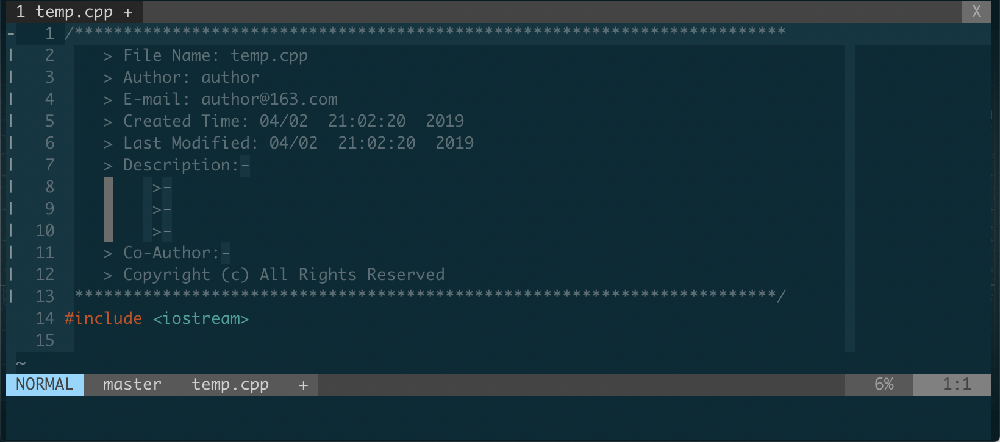

# vim-beauty-guide
This guide is to make your vim beautiful, and make it easy to use.

**The guide to make your bash beautiful, please refer to [bash-beauty-guide](https://github.com/MrCoderKai/bash-beauty-guide).**

# Contents
- [Configure Files List](#configure-files-list)
- [Environment](#environment)
- [Install and Customize iTerm2](#install-and-customize-iterm2)
- [Install Basic Tools](#install-basic-tools)
    - [Install brew](#install-brew)
    - [Install cmake](#install-cmake)
- [Install Ultimate Vimrc](#install-ultimate-vimrc)
- [Enable Syntax Highlight and Set Background and Colorscheme for Vim](#enable-syntax-highlight-and-set-background-and-colorscheme-for-vim)
- [Install MacVim](#install-macvim)
- [Install YouCompleteMe](#install-youcompleteme)
- [Install vim-indent-guides Plugin](#install-vim-indent-guides-plugin)
- [Install ctags](#install-ctags)
- [Install vim-gutentags Plugin](#install-vim-gutentags-plugin)
- [Functions](#functions)
- [Shortcuts](#shortcuts)
-   - [Vim](#vim)
    - [NERD tree](#nerd-tree)
    - [ctags](#ctags)
    - [Code Folder](#code-folder)

# Configure Files List
Describe: There are some other configurations that are not mentioned in this guide. An easy way to configure is move the following configure files to the specific path.

**Note: Even all configure files are provided, you should read this guide carefully.**

1. `.bash_profile`: This file should under path `~/`
2. `.vimrc`: This file should under path `~/`
3. `my_configs.vim`: This file should under path `~/.vim_runtime/`
4. `.ycm_extra_conf.py`: This file should under path `~/.vim_runtime/my_plugins/YouCompleteMe`

# Environment
1. Macbook Pro 2018
2. OS version: macOS Mojave 10.14.4 (18E226)

# Install and Customize [iTerm2](https://www.iterm2.com/)
1. Click [iTerm2 download link](https://www.iterm2.com/) to download iTerm2;
2. Double click downloaded **iTerm2-x_x_x.zip** file to unzip;
3. Double click unziped **iTerm** file, and choose **Move to Applications Folder**.

# Install Basic Tools
## Install **brew**
1. `/usr/bin/ruby -e "$(curl -fsSL https://raw.githubusercontent.com/Homebrew/install/master/install)"
`
## Install **cmake**
1. `brew install cmake`

# Install **Ultimate Vimrc**
1. `git clone --depth=1 https://github.com/amix/vimrc.git ~/.vim_runtime`
2. `sh ~/.vim_runtime/install_awesome_vimrc.sh`

# Enable Syntax Highlight and Set Background and Colorscheme for Vim
1. Generally, vim configurations are setted in **~/.vimrc** files. But, a better choice is **~/.vim_runtime/my_configs.vim** after installing **Ultimate Vimrc**.
2. `vim ~/.vim_runtime/my_configs.vim`
3. Add following configurations in **my_configs.vim**:
   ```
   syntax enable
   set background=dark
   colorscheme solarized
   syntax on
   ```
4. Exit vim and restart vim.

Detail usage of **Ultimate Vimrc**, please refer to [Included Plugins and remain sections](https://github.com/amix/vimrc#included-plugins)

# Install **MacVim**
In order to successfully install **YouCompleteMe** plugin, we should install **MacVim** to replace **vim**. Otherwise, the following error would accur:

```
Vim: Caught deadly signal SEGV
Error detected while processing function <SNR>91_PollServerReady[7]...<SNR>91_Pyeval: Vim: Finished.
line   4:
Exception MemoryError: MemoryError() in <module 'threading' from '/System/Library/Frameworks/Python.framework/Versions/2.7/lib/python2.7/threading.pyc> ignored [1] .  36295 segmentation fault vim
'
```

This error has been discussed in [issue 3271](https://github.com/Valloric/YouCompleteMe/issues/3271). The conclusion is

> This is not a YCM issue, it's clearly a Vim and/or macOS issue. Using Vim or macVim from homerbew is recommended.

1. Click [MacVim download link](https://macvim-dev.github.io/macvim/) to download **MacVim**;
2. Double click **MacVim.dmg** to install **MacVim**.
3. `/Applications/MacVim.app/Contents/MacOS/Vim ~/.bash_profile`
4. Add following configurations to **~/.bash_profile** to replace **vim** by **MacVim**
```
alias vim='/Applications/MacVim.app/Contents/MacOS/Vim'
alias vi='vim'
```
5. The default editor of command `crontab` is `nano`, which would accur the same error, which is talked above. Thus, its editor should be replaced by **MacVim**, too.
6. Add following configurations to **~/.bash_profile** to replace default editor of `crontab` by **MacVim**

```
# set default editor for command `crontab -e`, if not, error accurs
export EDITOR=/Applications/MacVim.app/Contents/MacOS/Vim
```
6. Exit editting **~/.bash_profile** and use `source ~/.bash_profile` to enable those configurations.

# Install **YouCompleteMe**

YouCompleteMe is a fast, as-you-type, fuzzy-search code completion engine for [Vim](https://www.vim.org/).
1. `cd ~/.vim_runtime/my_plugins`
2. `git clone https://github.com/Valloric/YouCompleteMe.git`
3. `git submodule update --init --recursive`
4. `cd ~/.vim_runtime/my_plugins/YouCompleteMe`
5. `./install.py --clang-completer`
After installing **YouCompleteMe**, we should create **.ycm_extra_conf.py** file and configure **YouCompleteMe** in **~/.vim_runtime/my_configs.vim** to make **YouCompleteMe** works normally. By default, there is a **.ycm_extra_conf.py** file in the **YouCompleteMe** installation folder - `~/.vim_runtime/my_plugins/YouCompleteMe/`, but it is not a right configuration file for C-family auto completion. Thus, we should create a new **.ycm_extra_conf.py** file for C-family auto completion. The steps are

1. `cd ~/.vim_runtime/my_plugins/YouCompleteMe/`
2. `mv .ycm_extra_conf.py .ycm_extra_conf.py.default`
3. `vim .ycm_extra_conf.py`
4. Copy the content of [this link](https://raw.githubusercontent.com/Valloric/ycmd/66030cd94299114ae316796f3cad181cac8a007c/.ycm_extra_conf.py) to the new **.ycm_extra_conf.py** file. This configuration works well for python and C-family languages, configurations for other languages please refer to [Offical Guides](https://github.com/Valloric/YouCompleteMe#c-family-semantic-completion)
5. Add following configurations to `~/.vim_runtime/my_configs.vim` file

```
" configurations for YouCompleteMe plugin
" disable those configurations is YouCompleteMe is not installed
let g:ycm_min_num_of_chars_for_completion = 2
let g:ycm_global_ycm_extra_conf = '/Users/administrator/.vim_runtime/my_plugins/YouCompleteMe/.ycm_extra_conf.py'
let g:ycm_confirm_extra_conf = 1
" automatically close preview window when leaving Insert mode
autocmd InsertLeave * if pumvisible() == 0|pclose|endif
" When this option is set to 1, YCM's identifier completer will also collect-
" identifiers from tags files.-
let g:ycm_collect_identifiers_from_tags_files = 1
" enable completion in comments and strings
let g:ycm_collect_identifiers_from_comments_and_strings = 1
" When this option is set to 1, YCM's identifier completer will seed its
" identifier database with the keywords of the programming language you're
" writing.
let g:ycm_seed_identifiers_with_syntax = 1
" Mapping keys. The Tab key in other plugins will be disabled without this.
let g:ycm_key_list_select_completion = ['<c-n>', '<Down>']
let g:ycm_key_list_previous_completion = ['<c-p>', '<Up>']
" disable diagnostic disaply features
let g:ycm_show_diagnostics_ui = 0
" Press <Enter> to select current item
inoremap <expr> <CR> pumvisible() ? "\<C-y>" : "\<CR>"
" Go to definition else declaration
nnoremap <c-j> :YcmCompleter GoToDefinitionElseDeclaration<CR>"
```

# Install **vim-indent-guides** Plugin
[Indent Guides](https://github.com/nathanaelkane/vim-indent-guides) is a plugin for visually displaying indent levels in Vim.
1. `cd ~/.vim_runtime/my_plugins`
2. `git clone git://github.com/nathanaelkane/vim-indent-guides.git`
3. `vim ~/.vim_runtime/my_configs.vim`
4. Add following configurations to **my_configs.vim**:
```
" configurations for vim-indent-guides pulgin
let g:indent_guides_enable_on_vim_startup = 1
set ts=4 sw=4 et
let g:indent_guides_guide_size = 1
let g:indent_guides_start_level = 2
let g:indent_guides_auto_colors = 0
autocmd VimEnter,Colorscheme * :hi IndentGuidesOdd  ctermbg=black
autocmd VimEnter,Colorscheme * :hi IndentGuidesEven ctermbg=darkgrey
```

# Install **ctags**
*This section is refered to [ctag.setup](https://gist.github.com/nazgob/1570678)*.

By default, **ctags** is installed on MacOS, but it does not work. For example:

Open termianl, and execute the following commands

`ctags -R --exclude=.git --exclude=log *`

and the output is

```
ctags: illegal option -- R
usage: ctags [-BFadtuwvx] [-f tagsfile] file ...
```
This means, **ctags** can not work correctly. Thus, we should install new **ctags**.

1. `brew install ctags`
2. Add the following configurations into **~/.bash_profile**:
```
#alias ctags if you used homebrew
alias ctags="`brew --prefix`/bin/ctags"
```

Now, **ctags** can be work correctly.

Note:

`ctrl+]` - Go to definition

`ctrl+T` - Go back

# Install vim-gutentags Plugin
[Gutentags](https://github.com/ludovicchabant/vim-gutentags) is a plugin that takes care of the much needed management of tags files in Vim. It will (re)generate tag files as you work while staying completely out of your way. It will even do its best to keep those tag files out of your way too. It has no dependencies and just works.

1. `cd ~/.vim_runtime/my_plugins`
2. `git clone https://github.com/ludovicchabant/vim-gutentags.git`
3. Add following configurations for vim-gutentags in `~/.vim_runtime/my_configs.vim`
```
" SOME CONFIGURATIONS FOR VIM_GUTENTAGA PLUGIN
let g:gutentags_project_root = ['.root', '.svn', '.git', '.project']
let g:gutentags_ctags_tagfile = '.tags'
let s:vim_tags = expand('~/.cache/tags')
let g:gutentags_cache_dir = s:vim_tags
if !isdirectory(s:vim_tags)
    ilent! call mkdir(s:vim_tags, 'p')
endif
let g:gutentags_ctags_extra_args = ['--fields=+niazS', '--extra=+q']
let g:gutentags_ctags_extra_args += ['--c++-kinds=+pxI']
let g:gutentags_ctags_extra_args += ['--c-kinds=+px']
```

**Explanations**

1. `gutentags_project_root` provides root marker of project. When `gutentags` is enabled, it will find file or folder specified in `gutentags_project_root` recursively. It stops searching util first found file or folder specified in `gutentags_project_root`.
2. `gutentags_ctags_tagfile` and `gutentags_cache_dir` specify the root of tag files and surfix, respectivly. The default name of tag file is a string that concated absolute path by `-`.
3. `gutentags_ctags_extra_args` configrates parameters of tag labels generated by ctags. More please refer to [this article](https://vim.ink/vim-ctag.html#%E4%BA%8C%E3%80%81ctags%E5%8F%82%E6%95%B0%E4%BB%8B%E7%BB%8D).

This section refers to [this article](https://www.cnblogs.com/pengdonglin137/articles/10202606.html).


# Functions
1. Author information can be automatically added when .sh/.cpp/.c/.py files are created.


After modification or re-name the file, press `F4` to update modify time and file name.

# Shortcuts
Description: The leader of VIM is mapper to `,` in `~/.vim_runtime/vimrcs/basic.vim` 
file.

## VIM
Those shortcuts can be found in`~/.vim_runtime/vimrcs/*.vim` files.

1. `,+m` - Fast saving
2. `,+g` - Open Ack and put the cursor in the right position


## NERD tree
1. `,+nn` - Toggle NERD tree
2. `,+nb` - NERD tree from bookmark
3. `,+nf` - NERD tree find

## ctags
1. `Ctrl+]` - Go to definition
2. `Ctrl+T` - Go back

## Code Folder
1. `zo` - Open code folder
2. `zO` - Open all code folders
3. `zc` - Close code folder
4. `zC` - Close all code folders
